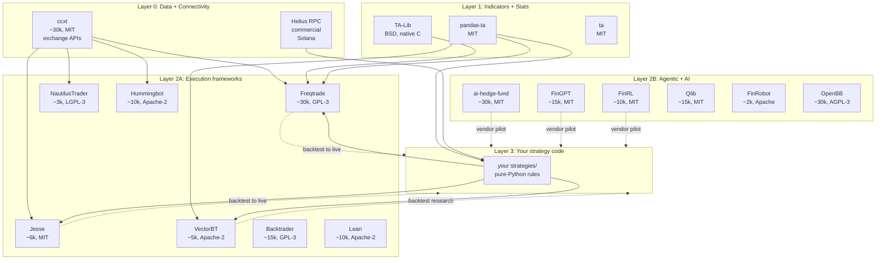
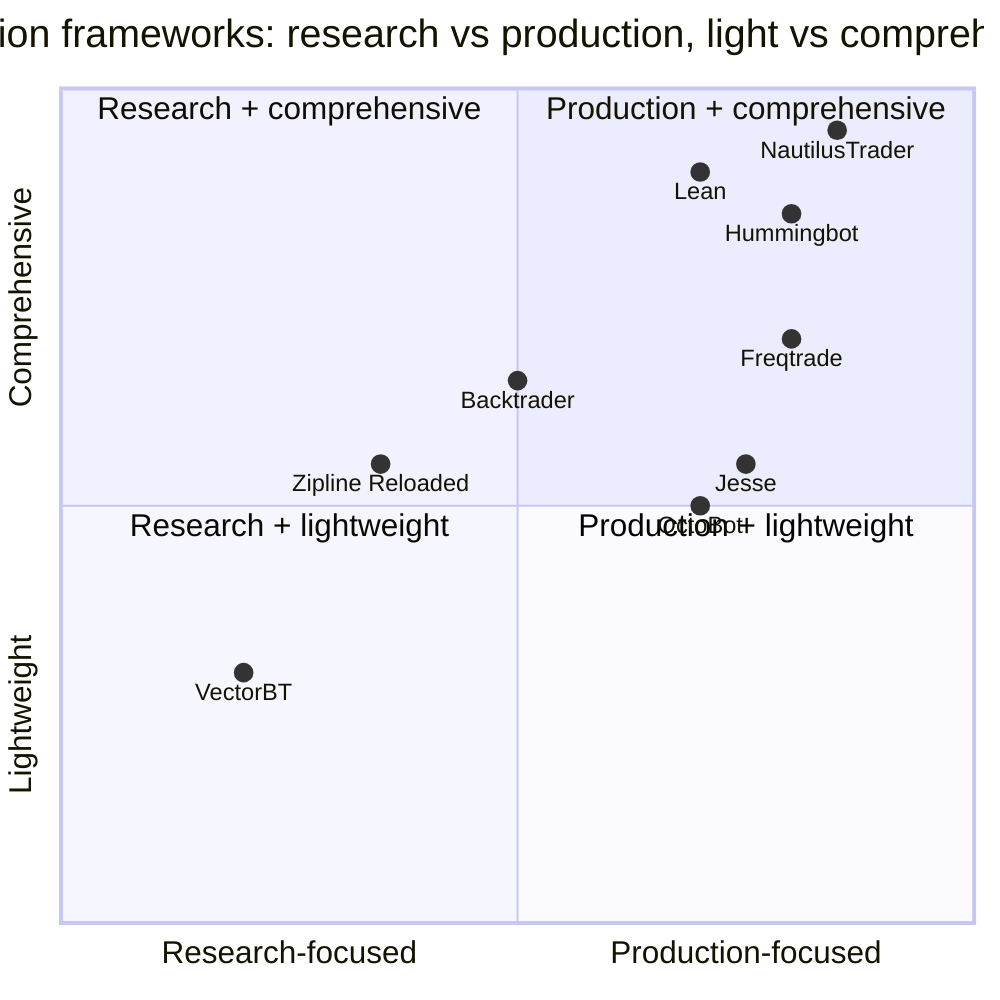
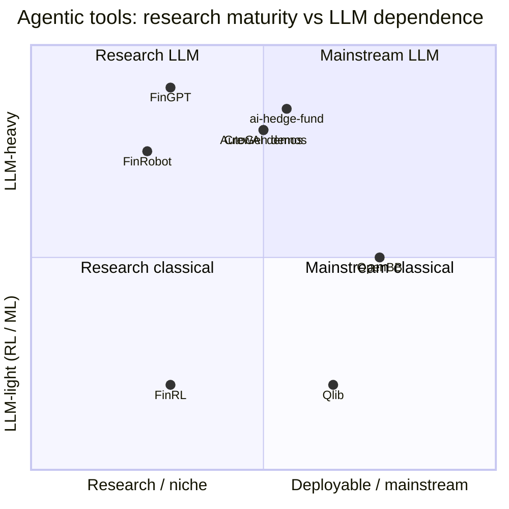
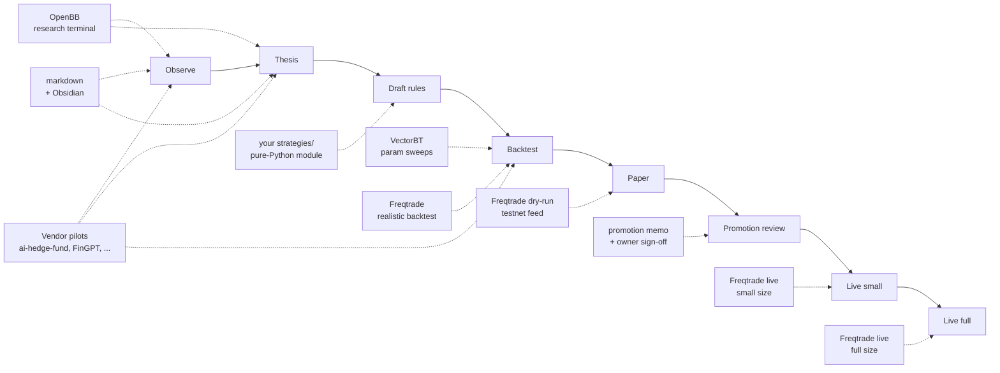

## About this survey

What people actually use for open-source algorithmic trading on GitHub as of April 2026. Split into three categories so you can reason about each without mixing apples and oranges:

- **A. Execution frameworks**: the infrastructure layer. Takes a strategy class, runs backtest + paper + live.
- **B. Agentic / AI-driven tools**: LLM, multi-agent, or RL-based systems. These are not replacements for category A; they sit alongside as signal generators or research aids.
- **C. Infrastructure libraries**: exchange connectivity, indicators, stats. Used regardless of framework choice.

Scored against the 5-question rubric from [[tool-evaluation-5-question-rubric]]. "Fit for semi-pro crypto" below maps to which stages of a standard research → backtest → paper → live lifecycle the tool serves.

## How to read this

- **Tables are the source of truth.** Skim the table, then read the deep-dives for tools you'd actually consider.
- **Verdicts are explicit.** "Skip because X" is a useful entry, not a negative review.
- **License column matters** even for private use: if you ever open-source a derivative, copyleft attachments become live. AGPL-3.0 also triggers on network service use, not just distribution.

## Ecosystem at a glance



Key takeaway: a strategy is authored once as a pure-Python module and wrapped for whichever execution framework (layer 2A) you pick. Agentic tools (layer 2B) arrive as time-boxed vendor pilots that generate recommendations, not as replacements for the execution layer.

---

## A. Execution frameworks

### Comparison table

| Framework | URL | Stars* | License | Active** | Primary use | Best for | Fit for semi-pro crypto | Verdict |
|-----------|-----|--------|---------|----------|-------------|----------|------------|---------|
| **Freqtrade** | `github.com/freqtrade/freqtrade` | ~30k | GPL-3.0 | yes, daily | Crypto bot, CEX | H4 trend/OB-OS on Binance | backtest + paper + live | **Primary pick** |
| **Jesse** | `github.com/jesse-ai/jesse` | ~6k | MIT | yes | Crypto bot, CEX | Event-driven strategies, cleaner code | backtest + paper + live | **Alt pick if MIT matters** |
| **VectorBT** | `github.com/polakowo/vectorbt` | ~5k | Apache-2.0 | yes | Vectorized backtest research | Fast parameter sweeps | backtest research | **Complement** |
| **Backtrader** | `github.com/mementum/backtrader` | ~15k | GPL-3.0 | slower cadence | Multi-asset backtest | Equities, older strategies | backtest mostly | Skip - momentum has moved to Freqtrade/Jesse |
| **NautilusTrader** | `github.com/nautechsystems/nautilus_trader` | ~3k | LGPL-3.0 | yes | Institutional, multi-asset | High-throughput, Rust core | backtest + paper + live | Skip - overkill for personal H4 |
| **Hummingbot** | `github.com/hummingbot/hummingbot` | ~10k | Apache-2.0 | yes | Market-making, CEX + DEX | Spread-capture strategies | paper + live MM only | Skip unless spread-capture is your strategy |
| **Lean (QC)** | `github.com/QuantConnect/Lean` | ~10k | Apache-2.0 | yes | Multi-asset, cloud-first | Equities + options + crypto | backtest + paper + live | Skip for personal crypto - C# core, cloud-oriented heavy |
| **OctoBot** | `github.com/Drakkar-Software/OctoBot` | ~3k | GPL-3.0 | yes | Crypto + dashboard | Non-coders | paper + live | Skip - dashboard UX over code fluency |
| **Zipline Reloaded** | `github.com/stefan-jansen/zipline-reloaded` | ~1k | Apache-2.0 | yes | Equities backtesting | Resurrected Quantopian code | backtest, equities | Skip for crypto |

*Approximate as of early 2026. **Active = commits within last 3 months at survey time.

### Deep-dive: Freqtrade

```
github.com/freqtrade/freqtrade    ~30k stars    GPL-3.0    Python 3.10+
```

The default answer for retail crypto Python traders. A strategy is a Python class subclassing `IStrategy` with three required methods: `populate_indicators`, `populate_entry_trend`, `populate_exit_trend`. Uses ccxt under the hood so every major CEX (including Binance testnet) is first-class.

**Why it leads**:

1. **Community depth.** Hundreds of public H4 / daily reference strategies on GitHub under the `freqtrade-strategies` org and personal repos. When you sit down to backtest a momentum strategy, you can compare parameterization against what the community is running on the same BTC/ETH data.
2. **Dry-run mode** matches paper-trading semantics almost exactly: live market data, no real fills, full metrics.
3. **ccxt-based** so credentials flow through a standard pattern. Bridge from your own credential store to Freqtrade `config.json` is a 50-line shim.
4. **Backtest output** covers most of the standard metric set natively: `n_trades`, `win_rate`, `expectancy`, `max_drawdown`. Missing pieces (`regime_breakdown`, `expectancy_R`) are post-processing.
5. **Hyperopt** built-in for parameter search, good-enough for H4 stakes.

**Concerns**:

- **GPL-3.0.** Dormant for personal use (no distribution = no copyleft obligation), live the moment you open-source a derivative. Flag at any future open-sourcing decision.
- **Config loading is JSON-first.** If you keep credentials off disk, you'll need to render Freqtrade config to a 0600 temp file at runtime and unlink on exit. Workable, minor attack surface.
- **Abstractions are many**: pair lists, protections, custom stoploss methods, custom order-type hooks. Curve is one weekend to productive, two to master.

### Deep-dive: Jesse

```
github.com/jesse-ai/jesse    ~6k stars    MIT    Python 3.11+
```

The cleaner-code alternative. Strategy classes expose `should_long`, `should_short`, `go_long`, `update_position` methods that read more like a trading system and less like a Pandas column-population exercise. MIT license means no licensing friction ever.

**Why it's a real alternative**:

1. **MIT license.** Zero downstream friction.
2. **Event-driven semantics** express OB/OS entry timing and dynamic stops more naturally than Freqtrade's shift-by-one patterns.
3. **Backtest + paper + live** via the same strategy code. Same architectural promise as Freqtrade.
4. **Built-in risk management abstractions**: position sizing, daily/total loss halts, max drawdown stops.

**Why it's second pick**:

- **Smaller community**: fewer reference strategies, fewer Stack Overflow answers, fewer Reddit threads. The difference bites during the "is this a normal Sharpe for this setup on H4 BTC?" sanity-checking moment.
- **Weaker ecosystem**: no dashboard analog to FreqUI, less polished plotting, less Telegram integration.
- **Hyperopt** present but less mature.

If starting today with no ecosystem consideration, Jesse would win on code quality. With ecosystem, Freqtrade wins.

### Deep-dive: VectorBT

```
github.com/polakowo/vectorbt    ~5k stars    Apache-2.0    Python 3.10+
```

Not an execution framework. A research library. You express signals as numpy arrays, VectorBT vectorizes the backtest across the full history in seconds instead of minutes. Running 500 parameter variants of a momentum strategy across 3 years of H4 BTC takes a couple of minutes; the equivalent in Freqtrade takes hours.

**Why it's the complement, not competitor**:

- Fast parameter exploration at the research stage before committing a specific config to paper.
- Apache-2.0, cleanest license of the three top picks.
- Outputs dataframes that plug into any JSON-based metric pipeline trivially.

**Why not primary**:

- **No live trading.** No paper trading either. Research-only.
- **Event-driven strategies are awkward** in vectorized form: you write it once cleverly, you can't read it a year later.

Pattern: "Explore in VectorBT, implement in Freqtrade or Jesse, paper-trade in Freqtrade/Jesse dry-run, promote to live in same."

### Positioning quadrant



Sweet spot for a semi-pro H4 crypto trader: right half, mid-height. Freqtrade and Jesse sit there. NautilusTrader, Lean, and Hummingbot sit too far into heavy production; VectorBT sits left in pure research.

### Recommendation for semi-pro crypto

**Primary: Freqtrade. Secondary: VectorBT.**

Community depth is the deciding factor at this stage. If MIT license matters (you expect to open-source), swap Freqtrade for Jesse as primary, VectorBT stays secondary. All other options (Backtrader, Nautilus, Hummingbot, Lean, OctoBot, DIY) are worse tradeoffs for this specific use case.

---

## B. Agentic / AI-driven tools

Different category. These do not *replace* the execution framework; they sit alongside it as experiments that generate signals or analyse data. Every one of them belongs in a vendor sandbox folder with hard rules: paper credentials only, network-egress logged, time-boxed pilot, output flows to your own adapter before any downstream use.

### Comparison table

| Tool | URL | Stars* | License | Style | Primary use | Fit for semi-pro crypto | Verdict |
|------|-----|--------|---------|-------|-------------|------------|---------|
| **ai-hedge-fund** | `github.com/virattt/ai-hedge-fund` | ~30k+ | MIT | LLM multi-agent (LangGraph) | Simulated hedge-fund with analyst/quant/sentiment agents | Vendor pilot, research signal generation | **First vendor pilot pick** |
| **FinGPT** | `github.com/AI4Finance-Foundation/FinGPT` | ~15k | MIT | LLM (Llama/Mistral fine-tunes) | Financial NLP: news, sentiment, filings | Vendor pilot, sentiment feature gen | Second pilot if ai-hedge-fund proves out |
| **FinRL** | `github.com/AI4Finance-Foundation/FinRL` | ~10k | MIT | RL (stable-baselines3) | Reinforcement learning for trading | Vendor pilot, alpha generation | Interesting but RL in crypto is hard - defer |
| **Qlib** | `github.com/microsoft/qlib` | ~15k | MIT | Classical ML + AutoML | End-to-end ML quant research platform | Vendor pilot, equities-biased | Skip for crypto; revisit if you add equities |
| **FinRobot** | `github.com/AI4Finance-Foundation/FinRobot` | ~2k | Apache-2.0 | LLM agents + tools | Multi-agent financial analysis | Vendor pilot, research summarization | Too early, ecosystem thin |
| **OpenBB** | `github.com/OpenBB-finance/OpenBBTerminal` | ~30k | AGPL-3.0 | Research terminal (not agentic) | Analyst workstation; CLI + Python API | Research mode, observation + thesis | AGPL is aggressive; use as read-only CLI only |
| **TradingGPT forks** | various | <2k each | varies | LLM wrapper | Tutorials, hobbyist | - | Skip - fragmented, no canonical leader |
| **AutoGen finance demos** | `github.com/microsoft/autogen` | ~30k (parent) | Apache-2.0 | Multi-agent framework | General-purpose agent framework | DIY pilot | Build your own thin wrapper rather than vendor |
| **CrewAI finance demos** | `github.com/joaomdmoura/crewAI` | ~20k (parent) | MIT | Multi-agent framework | General-purpose agent framework | DIY pilot | Same as AutoGen - framework, not trading tool |

*Approximate, 2026-01 snapshot.

### Deep-dive: ai-hedge-fund

```
github.com/virattt/ai-hedge-fund    ~30k+ stars    MIT    Python + LangGraph
```

The most popular agentic trading repo on GitHub. Built as a LangGraph multi-agent system that simulates a hedge-fund team: analyst agents consume fundamentals, sentiment agents read news, a risk manager agent aggregates, a portfolio manager agent allocates. Output is a trade recommendation for a ticker set. Strictly a signal generator, not an execution framework (it does not place orders).

**Why it's the first vendor pilot pick**:

1. **MIT license.** No copyleft concerns under any future open-sourcing scenario.
2. **Shape matches a typical sandbox.** It generates recommendations as structured output; you write an adapter to normalize to your own JSONL schema. Read-only by construction (no exchange credentials required at all in typical usage).
3. **Famous + legible.** Thousands of GitHub users have forked and extended it. The code is small enough (tens of Python files) to read in a session. Low forensic cost when something misbehaves.
4. **Useful even in negative.** Even if you decide its signals are noise, the code is an instructive example of LangGraph multi-agent patterns you might reuse elsewhere.

**Concerns**:

- **Agents call third-party LLM APIs.** Your wrapper must log every network egress. Know exactly what's going where.
- **Prompts + outputs are potentially sensitive.** Don't feed real portfolio state into the agents on a pilot run; use synthetic tickers.
- **Not designed for H4 crypto.** Primarily equity-ticker focused; will need adaptation to generate H4 BTC signals. That adaptation is itself informative - exposes where agents break.

### Deep-dive: FinGPT

```
github.com/AI4Finance-Foundation/FinGPT    ~15k stars    MIT    Python + PyTorch
```

The AI4Finance lab's LLM stack: fine-tuned open-source models (Llama, Mistral variants) for financial NLP tasks. News sentiment, earnings-call summarization, filings extraction. Not a trading system. A feature-engineering source.

**Where it fits**:

- Crypto news sentiment on H4 → feed as a feature into a momentum regime filter (e.g., "if BTC news sentiment is extremely negative over last 24h, avoid long breakouts"). A backtest with the sentiment feature vs. without would quickly show whether it adds edge.
- Same sandbox rules apply: paper creds, network logged, adapter normalizes output.

**Why second pilot not first**:

- More infrastructure to stand up (Python model serving, GPU preferred). Worth it only after a simpler agentic pilot proves the sandbox pattern works.

### Deep-dive: FinRL

```
github.com/AI4Finance-Foundation/FinRL    ~10k stars    MIT    Python + stable-baselines3
```

Reinforcement-learning framework for trading. Agents are PPO/DQN/SAC policies trained on historical data. Interesting academically; hard in crypto practice (non-stationary markets eat RL policies alive).

**Verdict**: defer until you have (a) a baseline mechanical strategy that works (something has to beat), (b) a paper-trading pipeline that can log enough data to train against, (c) appetite for the research overhead. Most semi-pro setups don't meet any of the three.

### Positioning quadrant



For a first pilot, aim for the mainstream-LLM quadrant (top-right): enough community that integration notes exist, active enough that a found problem is a fixable problem. ai-hedge-fund sits there. FinGPT sits top-left (research-LLM), interesting but heavier lift.

### First vendor pilot recommendation

**ai-hedge-fund**, 30-day time-box.

Objective: does its signal output, when normalized through your adapter and back-tested against the same H4 window you'd use for a momentum strategy, show an edge? If yes, extract the signal logic into your own strategy code; if no, graveyard with postmortem.

Not-first pilots (defer): FinGPT (2nd), AutoGen/CrewAI DIY wrapper (3rd), Qlib (only if you add equities), FinRL (defer indefinitely until baseline exists).

---

## C. Infrastructure libraries

These aren't framework choices. They're building blocks that show up regardless of execution-framework outcome.

| Library | URL | License | Role | Use |
|---------|-----|---------|------|-----------------|
| **ccxt** | `github.com/ccxt/ccxt` | MIT | CEX connectivity, unified API across 100+ exchanges | Every CEX connector imports it. |
| **pandas-ta** | `github.com/twopirllc/pandas-ta` | MIT | Indicator library, pandas-native | Candidate for indicator calls (RSI, Bollinger, ATR, ADX, Donchian). |
| **TA-Lib** | `ta-lib.org` / `github.com/ta-lib/ta-lib-python` | BSD | Classic C indicator library, Python bindings | Faster than pandas-ta for large windows; installation is gnarly on macOS (needs `brew install ta-lib` first). |
| **ta** | `github.com/bukosabino/ta` | MIT | Modern Python-only indicator library | Simpler install than TA-Lib, comparable feature set. Reasonable default. |
| **statsmodels** | `github.com/statsmodels/statsmodels` | BSD | Stats, regression, time series | Regime-classification research (ADF test, Hurst exponent). |
| **QuantLib** | `github.com/lballabio/QuantLib` | modified BSD | Derivatives pricing library, options math | Irrelevant until options trading is active. |
| **arctic / ArcticDB** | `github.com/man-group/ArcticDB` | Apache-2.0 | Tick-data storage | Overkill for H4. Revisit if tick data becomes relevant. |

**Pick**: `pandas-ta` for most semi-pro setups. TA-Lib only if a profiler tells you pandas-ta is the bottleneck (very unlikely at H4).

---

## Lifecycle-to-tool map

Which tool serves which stage of research → live.



Note: vendor pilots show up at observation/thesis (idea generation) and backtest (signal comparison against your baseline). They do not live in paper/live stages - any signal that proves out gets extracted into your own pure-Python module.

---

## Summary verdicts

### Primary execution stack

**Freqtrade (primary) + VectorBT (research secondary).** Community depth wins for a semi-pro crypto trader. GPL dormant for personal use. MIT preference would flip to Jesse as primary; VectorBT stays secondary.

### First vendor pilot

**ai-hedge-fund**, 30-day time-box, paper credentials only. MIT license, legible code, most-popular-in-category.

### What NOT to pilot yet

- **FinRL**: defer until baseline mechanical strategy exists and a paper-trading log is generating training data.
- **Qlib**: defer unless you add equities.
- **FinRobot**: ecosystem too thin.
- **OpenBB**: AGPL-3.0 is aggressive (network-use trigger). Acceptable as a read-only research CLI invoked from the shell, not imported as a library.
- **TradingGPT forks, hobbyist tools**: fragmented, no canonical leader, high forensic cost per bug.
- **DIY anything**: at semi-pro personal-account scale, reimplementation time has poor leverage.

#finance-tooling #evaluation #synthesis #freqtrade #jesse #vectorbt #ai-hedge-fund #fingpt #agentic-trading

## Related

- [[tool-evaluation-5-question-rubric]] - the 5-question rubric used to score individual tools
- [[ai-dev-stack-8-layer-model-with-tool-evaluations-march-2026]] - parallel synthesis in the AI dev-tooling domain; same shape, different verticals
- [[hermes-agent-comprehensive-briefing-april-2026]] - Hermes as LLM backend for agentic vendor pilots
- [[hermes-vs-openclaw-competitive-scene-april-2026]] - agentic-coding comparison; adjacent-domain signal on multi-agent patterns
- [[fincept-terminal-evaluation]] - example single-tool eval in the finance-tooling folder
