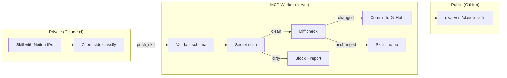
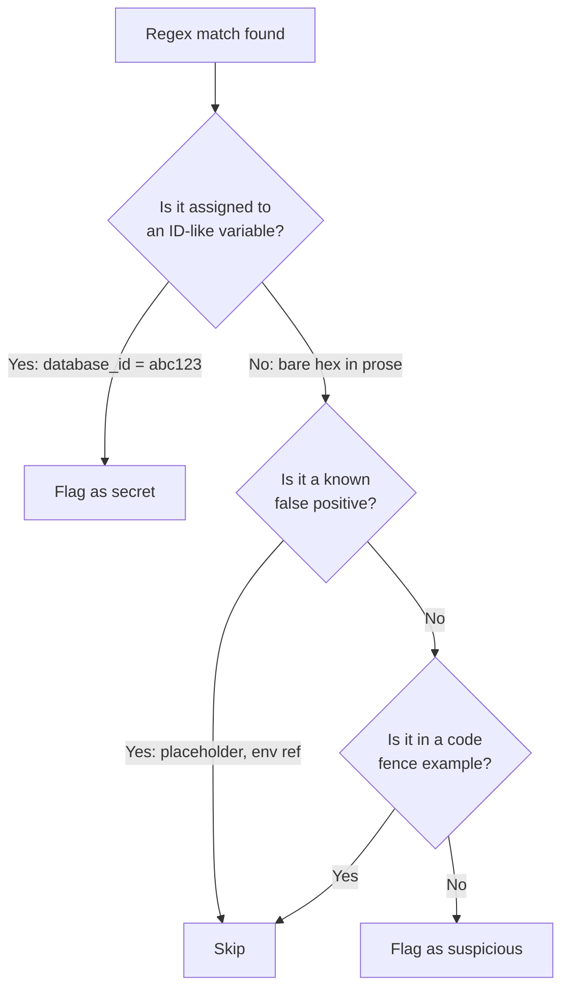
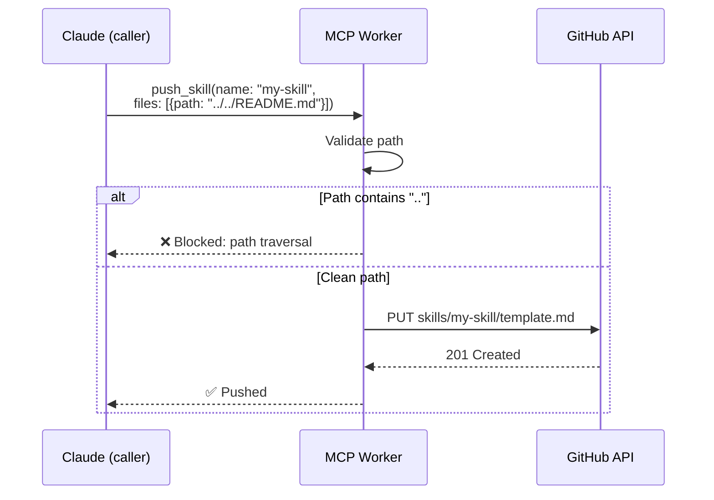
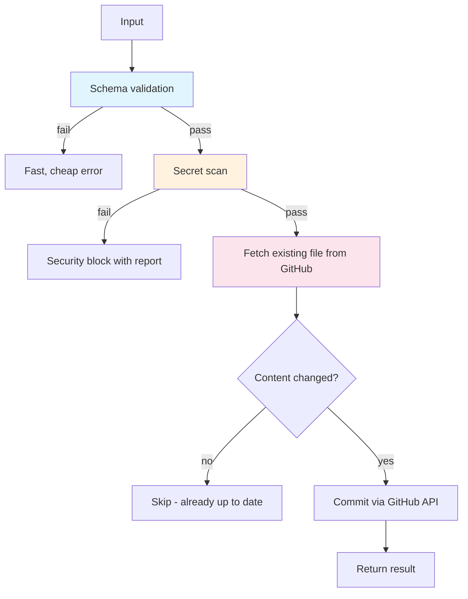

## The problem

When an MCP tool pushes content from a private environment (like Claude.ai with Notion connected) to a public GitHub repo, the tool itself is the last checkpoint before secrets go public.

Client-side classification (a skill that labels content SAFE/SENSITIVE) helps, but it runs in the caller's context. The caller is an LLM. LLMs can be prompt-injected, confused, or simply skip the step. The server must enforce.



The key insight: **the security gate belongs at the server, not the client**. The MCP worker is the chokepoint. Every path to the public repo goes through it. Put the scanner there.

## Lesson 1: Context-anchored pattern matching

We started with bare regex patterns to catch secrets:

```
# First attempt: bare hex match
/[0-9a-f]{32}/   → catches Notion database IDs
```

This would have blocked every skill that mentions a Git SHA in documentation, every hex color code, every content hash. The pattern has no context. It's classification without features.

The fix: anchor patterns to assignment context.

```
# Bad: matches any 32-char hex (Git SHAs, hashes, colors)
/[0-9a-f]{32}/

# Good: only matches when assigned to an ID-like variable
/(?:database_id|page_id|spaceId)\s*[:=]\s*["']?[0-9a-f-]{32,36}["']?/i
```



**The transferable principle**: pattern matching without context is useless for security scanning. The same string (`a1b2c3d4...`) means different things in different positions. A secret detector that ignores position will either miss everything (too lenient) or block everything (too strict).

**How to spot this**: whenever you're writing regex-based validators, ask "what legitimate content would this also match?" If the answer is "lots of things," you need context anchoring.

## Lesson 2: Path traversal on LLM-provided file paths

The `push_skill` tool accepts a `files` array for extra assets (templates, scripts). Each file has a `path` field. What if the path is `../../README.md`?

In a traditional API, the caller is a human or a trusted service. In an MCP tool, the caller is an LLM that:
- Can be prompt-injected via skill content
- Can hallucinate paths
- Has no concept of "this path escapes the skill folder"



**Minimum validation for LLM-provided paths:**
1. Strip leading slashes
2. Reject any path containing `..`
3. Reject absolute paths
4. Constrain to the expected directory prefix

**The transferable principle**: when your API caller is an LLM, treat ALL input as untrusted. Not because the LLM is malicious, but because it's manipulable. The same path validation you'd do for user-uploaded files applies here.

## Lesson 3: The gate pipeline pattern

The three checks (validation → secret scan → diff check → commit) aren't just a sequence. They're ordered by cost and reversibility:



1. **Schema validation** — cheapest, no network calls, catches bad input fast
2. **Secret scan** — CPU only, no network, catches security issues before any external call
3. **Diff check** — one GitHub API call, prevents unnecessary commits
4. **Commit** — the expensive, irreversible action, happens last

**The transferable principle**: order your gates by cost ascending and reversibility descending. The cheapest, most-reversible check goes first. The expensive, irreversible action goes last. This applies to any pipeline that ends with a side effect (deploy, send, publish, commit).