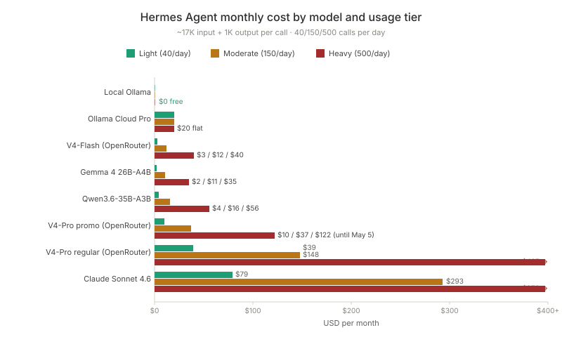

Three pricing models compete for the same set of open-weight LLMs (DeepSeek-V4, Qwen3.6, Gemma 4). The right choice depends entirely on monthly token volume and willingness to commit to a subscription.

Verified pricing as of April 28, 2026.

## Provider matrix per model

**DeepSeek-V4-Flash** (per 1M tokens, input/output):

| Provider | Input | Output | Notes |
|---|---|---|---|
| DeepSeek direct | $0.14 / $0.28 | cache-hit $0.014 (10x off) | Hosted in China, 503s during peak, off-peak 50% discount |
| Ollama Cloud | included in $20/$100 plan | flat | US-hosted Blackwell, zero-retention |
| OpenRouter | $0.14 / $0.28 | varies | Multiple US providers |

**DeepSeek-V4-Pro** (per 1M tokens):

| Provider | Input | Output | Notes |
|---|---|---|---|
| DeepSeek direct (promo) | $0.435 / $0.87 | cache-hit $0.0036 | **Promo expires May 5, 2026 15:59 UTC** |
| DeepSeek direct (regular) | $1.74 / $3.48 | $0.174 cache-hit | Post-promo pricing |
| Ollama Cloud | included in $20/$100 plan | flat | Same subscription tier |
| OpenRouter | $0.435 / $0.87 | varies | Currently mirroring promo |

**Qwen3.6-35B-A3B** (per 1M tokens). Not on Ollama Cloud as a hosted route:

| Provider | Input | Output | Notes |
|---|---|---|---|
| Alibaba Cloud direct | $0.16 / $0.97 | tiered above 256k | Apache 2.0 |
| OpenRouter | $0.16 / $0.97 | mirrors Alibaba | |

**Gemma 4 26B-A4B** (per 1M tokens):

| Provider | Input | Output | Notes |
|---|---|---|---|
| OpenRouter | $0.06 / $0.33 | DeepInfra cheapest | 11 providers available |
| OpenRouter `:free` | $0 / $0 | rate-limited | Useful for experimentation |

## Cost projections at three Hermes Agent usage tiers

Assumes ~17K input + 1K output per Hermes call.

| Model / path | Light (40 calls/day) | Moderate (150/day) | Heavy (500/day) |
|---|---|---|---|
| Local Ollama | $0 | $0 | $0 |
| Ollama Cloud Pro (flat) | $20 | $20 | $20 if within limits |
| V4-Flash via OpenRouter | $3 | $12 | $40 |
| V4-Flash + 65% cache hit | $1 | $4 | $14 |
| Gemma 4 26B-A4B paid | $2 | $11 | $35 |
| Qwen3.6-35B-A3B | $4 | $16 | $56 |
| V4-Pro promo (until May 5) | $10 | $37 | $122 |
| V4-Pro regular (post-May 5) | $39 | $148 | $497 |
| Claude Sonnet 4.6 (reference) | $79 | $293 | $978 |

## Verdict by usage profile

**Light usage (under ~10M tokens/month):** Pay-per-token wins. OpenRouter for everything. Subscriptions waste money. At light usage Ollama Cloud Pro $20 is more than DeepSeek-V4-Flash on OpenRouter would cost ($3-12/month).

**Moderate-to-heavy usage with frequent V4-Pro escalation:** Ollama Cloud Pro $20/month flat decisively beats pay-per-token. Breakeven at ~10M tokens for V4-Pro post-May 5 (regular pricing). Hermes integration is cleaner because Ollama Cloud uses the same `localhost:11434` endpoint as local. No auth complexity, no separate SDK.

**Privacy-sensitive workloads:** Ranking from most to least private: local > Ollama Cloud (US, zero-retention) > OpenRouter (routing layer with multiple hops) > DeepSeek direct (hosted in China).

**Avoid DeepSeek direct API entirely.** The promo-expiring-May-5 trap is one issue, but the bigger problem is reliability: agentic loops break when the API returns 503s during Beijing peak hours. Use OpenRouter or Ollama Cloud as the proxy.

## The promo trap

DeepSeek-V4-Pro is currently 75% off until May 5, 2026 15:59 UTC. After expiration, prices on direct API and OpenRouter (which mirrors) jump 4x: input $0.435 to $1.74, output $0.87 to $3.48.

If you're choosing a default model based on April 2026 pricing, factor in May 6 onward. Ollama Cloud subscription becomes materially better for V4-Pro-heavy workflows post-promo.

## Hermes-specific observations

Hermes Agent fires ~13.9K tokens of fixed overhead per call. Implications:
- Cheap-input models dominate for Hermes (Gemma 4 at $0.06/M and V4-Flash at $0.14/M dramatically outperform Qwen3.6-27B at $0.33/M input)
- Cache-hit pricing is huge. The 13.9K overhead is identical across calls in a session, perfect for prefix caching at 65-70% hit rates
- Output ratios matter less than input ratios because Hermes calls are mostly tool-call generation, not long prose

## Decision framework

1. Estimate calls/day for your actual workload using `hermes /usage` and `/insights` for one week
2. Multiply by 30 for monthly call count, then by ~17K input + 1K output for token volume
3. Check the projection table above
4. If V4-Pro usage is frequent post-May 5, subscribe to Ollama Cloud Pro
5. Otherwise stay on pay-per-token via OpenRouter with a $50/month spending cap as hard ceiling

Source: OpenRouter pricing pages, DeepSeek API docs, Ollama pricing page, all verified April 28, 2026.

## Related

- [[hermes-agent-fixed-overhead-13-9k-tokens-per-api-call]] - companion: per-call overhead × this pricing = $/call; "cheap-input dominates" follows directly
- [[ollama-cloud-cloud-suffix-hosted-inference-via-local-endpoint]] - the `:cloud` suffix mechanism behind one of the three pricing options
- [[local-llm-hybrid-stack-ollama-ollama-cloud-openrouter-for-hermes-agent]] - the routing decision this pricing table feeds into
- [[claude-code-cost-mechanics-corrected-for-opus-4-7-april-2026]] - parallel pricing reckoning in the Claude Code domain
- [[hermes-agent-comprehensive-briefing-april-2026]] - the runtime that consumes these prices