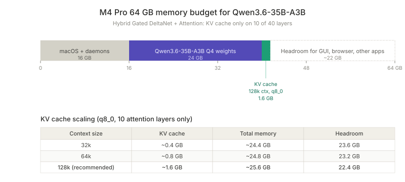

## Overview

Qwen3.6-35B-A3B is a 35B-parameter MoE model with 3B active parameters per token, using a hybrid architecture that alternates Gated DeltaNet (linear attention, no KV cache) with standard Gated Attention. Only **10 of 40 layers carry KV cache**. This dramatically changes the memory math compared to a pure transformer.

The 40-layer layout: 10 repeats of (3 × Gated DeltaNet → MoE) + (1 × Gated Attention → MoE). DeltaNet layers maintain a recurrent state instead of a KV cache, which keeps memory usage flat as context grows.

This makes a 64 GB Apple Silicon Mac (M4 Pro or larger) a genuinely capable host for this model at full 128K context, something that wouldn't fit on a typical transformer architecture at this size.

## Memory budget



On a 64 GB unified memory system:
- macOS plus background daemons (Homebrew services, Hermes gateways, Tailscale, etc.) reserve ~16 GB
- Available for inference: ~48 GB
- Qwen3.6-35B-A3B Q4 weights via Ollama: ~24 GB
- Headroom for KV cache plus GUI plus other apps: ~24 GB

Ollama 0.19+ uses MLX as the native backend on Apple Silicon, so weights are loaded directly into unified memory (no GPU offload decision needed).

## Context window sizing

KV cache scales linearly only on the attention layers. With `OLLAMA_KV_CACHE_TYPE=q8_0` (8-bit cache, near-zero quality loss):

| Context size | KV cache | Total memory | Headroom |
|---|---|---|---|
| 32k | ~0.4 GB | ~24.4 GB | 23.6 GB |
| 64k | ~0.8 GB | ~24.8 GB | 23.2 GB |
| **128k (recommended)** | **~1.6 GB** | **~25.6 GB** | **22.4 GB** |
| 256k | ~3.2 GB | ~27.2 GB | 20.8 GB |

The model's own training guidance: "maintain a context length of at least 128K tokens to preserve thinking capabilities." Going below that degrades the reasoning preservation feature that makes the model useful for agentic loops.

**Set `OLLAMA_CONTEXT_LENGTH=131072` (128k) as default.** Memory cost is trivial; quality benefit is real because the model was trained for this window.

## Prefill cost

The hidden cost of a large context window. Before the model emits its first token, it must compute attention over the entire prompt (system prompt, tool definitions, conversation, new message). This is the **prefill** phase.

On M4 Pro, prefill throughput averages ~300 tok/s across the hybrid architecture (DeltaNet layers prefill faster than attention layers).

| Prompt size | Prefill time | Feels like |
|---|---|---|
| 5k tokens | ~15 sec | Snappy |
| 17k (typical Hermes call) | ~55 sec | Noticeable wait |
| 32k (long session) | ~1.5 min | "Is it broken?" |
| 64k | ~3 min | Painful |
| 128k (full window) | ~7 min | Don't do this routinely |

**Mitigation: prompt caching.** Subsequent calls in the same session reuse cached prefix attention. Cold start is slow; follow-ups in the same session are sub-second. Don't restart sessions unnecessarily, that throws away the warm cache.

Setting max context to 128k doesn't mean every call prefills 128k tokens. It just provides headroom. Most Hermes calls stay under 30k actual prompt size.

## Concurrent models

**Don't run two large chat models simultaneously.** With ~48 GB usable:
- qwen3.6:35b (24 GB) + qwen3.6:27b (17 GB) = 41 GB, leaves 7 GB headroom, swaps under any GUI load
- qwen3.6:35b + gemma4:26b: same problem
- qwen3.6:35b + nomic-embed-text (274 MB): fine, do this if embeddings needed

Set `OLLAMA_MAX_LOADED_MODELS=1` to prevent Ollama from auto-loading a second large model. Use `OLLAMA_KEEP_ALIVE=30m` to keep the active model warm during a session. Switching via `hermes model` then takes 10-15 seconds for unload+load, fast enough for occasional switches.

## Recommended Ollama env vars

```fish
set -gx OLLAMA_KV_CACHE_TYPE q8_0       # halve KV cache memory
set -gx OLLAMA_FLASH_ATTENTION 1        # 10-15% speed at long context
set -gx OLLAMA_MAX_LOADED_MODELS 1      # prevent concurrent large model loads
set -gx OLLAMA_KEEP_ALIVE 30m           # keep model warm during session
set -gx OLLAMA_CONTEXT_LENGTH 131072    # 128k default
```

## Key decisions

- **128k default, not 32k.** The hybrid architecture makes it cheap; the model is trained to need it.
- **q8_0 KV cache, not f16.** Halves memory at near-zero quality cost.
- **Single model loaded at a time.** Memory math forbids two large chat models on 64 GB.
- **Don't touch llama.cpp directly.** Ollama 0.19+ runs MLX natively; switching backends loses vision support and tool-call reliability.

## Related

- [[local-llm-hybrid-stack-ollama-ollama-cloud-openrouter-for-hermes-agent]] - the broader stack this Qwen tier slots into as the local default
- [[ollama-cloud-cloud-suffix-hosted-inference-via-local-endpoint]] - the escalation path when 128k local context isn't enough or tool calls fail
- [[hermes-agent-fixed-overhead-13-9k-tokens-per-api-call]] - why context size matters: 13.9K of fixed prefill on every Hermes call