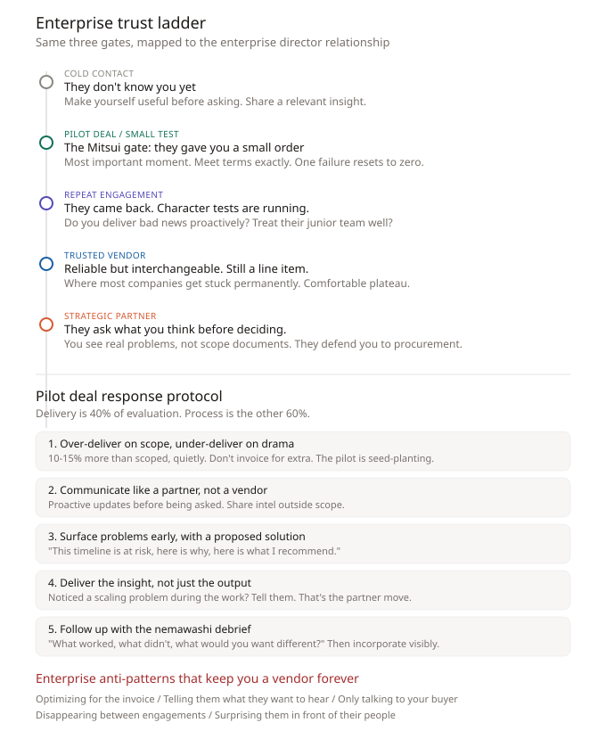

# Enterprise Trust Ladder: From Vendor to Strategic Partner

The same character/value/role-ambiguity dynamic that plays out at dinner tables applies when navigating enterprise relationships. Enterprise directors run the same invisible tests before trusting you with real scope.

## The 5 rungs

### Rung 1: Cold contact
You are one of dozens of vendors in their inbox. The Nathan Rothschild play: make yourself useful before asking for anything. Share a relevant insight about their industry. Solve a small, visible problem for free. The goal is not a deal. The goal is name recognition.

### Rung 2: Pilot deal / small test (THE MITSUI GATE)
The most important moment. They gave you a small order. The Mitsui house code: meet terms exactly, and the next deal is slightly larger. Miss the terms, and the relationship resets to zero. No exceptions.

They are watching everything, not just the deliverable.

### Rung 3: Repeat engagement
Character tests are running. Do you deliver bad news proactively or hide it? Do you pad timelines or give honest estimates? Do you treat their junior team the same as the director? Do you talk about their competitors?

### Rung 4: Trusted vendor (THE PLATEAU)
You deliver reliably. But you are still interchangeable. A line item. They like you, might recommend you, but you don't see their real problems. You see scope documents. The real conversations happen in rooms you're not in.

**This is where most companies get stuck permanently.**

### Rung 5: Strategic partner
They consult you on problems outside your contracted scope. They introduce you to their peers. They defend your involvement to procurement. You are no longer selling. You are inside the information perimeter.

## Pilot deal response protocol

Delivery is 40% of what they evaluate. Process is the other 60%.

1. **Over-deliver on scope, under-deliver on drama**: 10-15% more than scoped, quietly. Don't invoice for extra.
2. **Communicate like a partner, not a vendor**: Proactive updates before being asked. Share intel outside scope.
3. **Surface problems early, with a proposed solution**: "This timeline is at risk, here is why, here is what I recommend."
4. **Deliver the insight, not just the output**: Noticed a scaling problem? Tell them. That's the partner move.
5. **Follow up with the nemawashi debrief**: "What worked, what didn't, what would you want different?"

## Enterprise anti-patterns (vendor forever)

- **Optimizing for the invoice**: Change-requesting every out-of-scope discovery
- **Telling them what they want to hear**: Agreeing with unrealistic timelines
- **Only talking to your buyer**: Single-threaded relationship dies when that person moves
- **Disappearing between engagements**: Partners share intelligence between deals
- **Surprising them publicly**: Never surprise the director in front of their boss