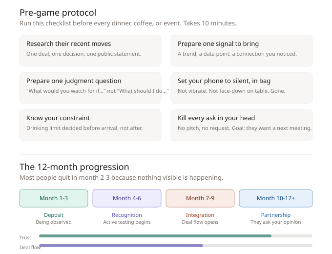

# The 12-Month Progression: From Deposit to Partnership

There is a predictable timeline for how trust builds with older/wealthier people. Most people quit in month 2-3 because nothing visible is happening. Understanding the phases prevents premature quitting.

## Phase 1: Deposit (Month 1-3)

**Trust: ~15%. Deal flow: 0%.**

You are being sorted into a category. You show up, listen (70/30 ratio), bring small signals, follow up the next day referencing something specific. You share useful information same-day. You keep every small promise. You treat every person at the table the same regardless of status.

**What you get**: nothing visible.

**What is actually happening**: they are running invisible tests. Most young people get sorted into "nice but no signal" or "wants something." Target category: "thinking independently, worth watching."

## Phase 2: Recognition (Month 4-6)

**Trust: ~40%. Deal flow: ~10%.**

The dynamic shifts. They ask your opinion on something real. They give you a small task with ambiguous instructions (the competence test). They share mildly confidential information (the loyalty test).

**The disagreement moment**: They say something you disagree with. If you nod along, you stay in the "nice kid" category forever. If you offer a nuanced counter-opinion with your own reasoning, you pass the independence test. They do not want another yes-man.

**What you get**: invitations to smaller, more private settings. The conversation shifts from polite to real.

## Phase 3: Integration (Month 7-9)

**Trust: ~65%. Deal flow: ~35%.**

They mention a deal, a project, a person in a way that is clearly not casual. This is the first real deal flow. It is a signal that you are inside the information perimeter.

**Your move**: do not jump at it. Ask a judgment question: "What's the risk profile you're seeing?" Desperation at this stage undoes everything.

**What you get**: curated introductions. Not generic "you should meet" but specific "you're both working on X." Each introduction is an endorsement of your character.

## Phase 4: Partnership (Month 10-12+)

**Trust: ~85%. Deal flow: ~60%.**

The lens flips. They start asking what you think. Usually in your area of competence (tech, a market they don't understand, a generational gap). You have something they need: a different vantage point.

**The final test**: can you handle this without becoming entitled? The moment you start expecting deal flow as owed rather than earned, you start the decline.

## Why most people never get past month 3

Three reasons:

1. **Invisible progress**: nothing comes back for weeks. They conclude the approach is broken and start pitching (kills it) or stop showing up (kills it slower).
2. **Failed confidentiality test**: one piece of shared info gets repeated. The door closes silently. Nobody tells you why.
3. **Pleasant and forgettable**: they show up, listen, are nice, and bring zero signal. The most common failure mode.

## Pre-game protocol (10 minutes before any high-stakes interaction)

1. **Research their recent moves**: one deal, one decision, one public statement
2. **Prepare one signal to bring**: a trend, a data point, a connection you noticed
3. **Prepare one judgment question**: "What would you watch for if..." not "What should I do..."
4. **Phone to silent, in bag**: not vibrate, not face-down on table, gone
5. **Know your constraint**: drinking limit decided before arrival
6. **Kill every ask in your head**: no pitch, no request. Only goal: they want a next meeting